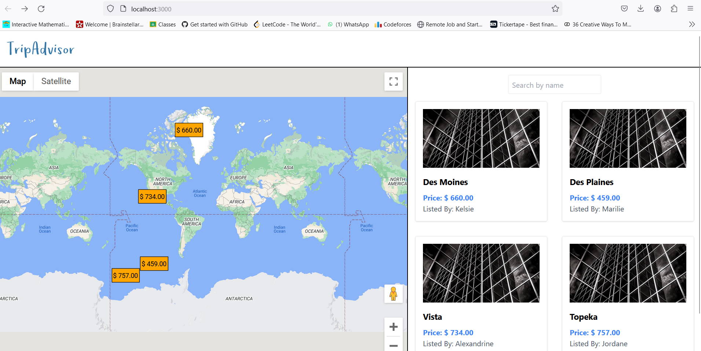
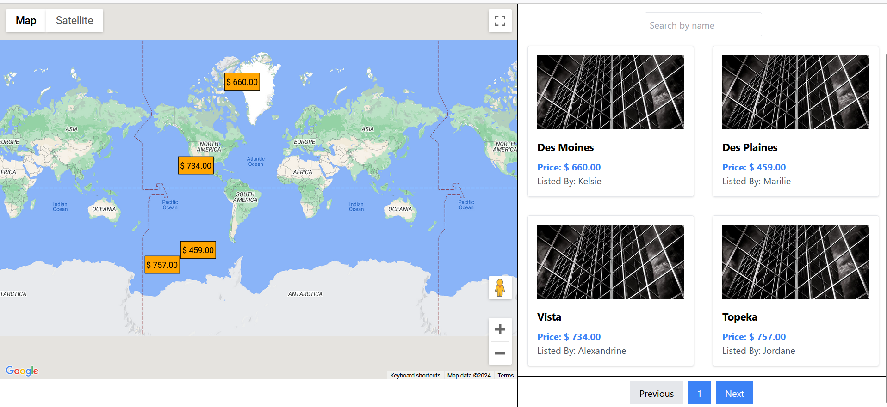
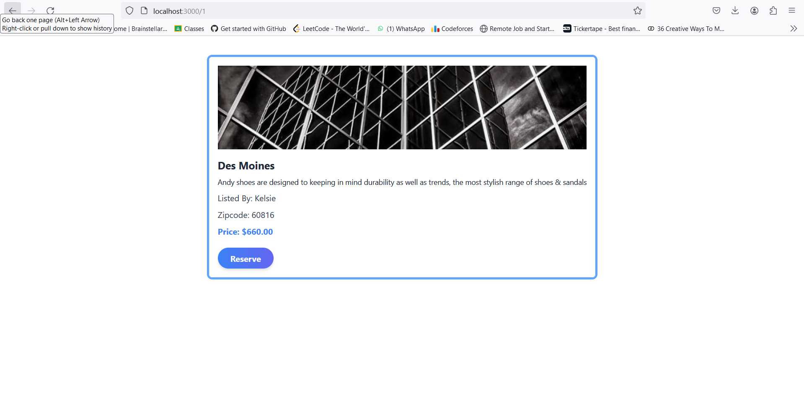

This is a Tour booking site consist of different location over the globe.

## Getting Started

To get started, follow these steps:

```bash
# Clone the repository
git clone https://github.com/your-username/Startup-assignment-Dev-Agrawal.git

# Change into the frontend directory
cd Startup-assignment-Dev-Agrawal
cd frontend

# Install dependencies
npm install

# Start the development server
npm start

# Snapshots of the project


