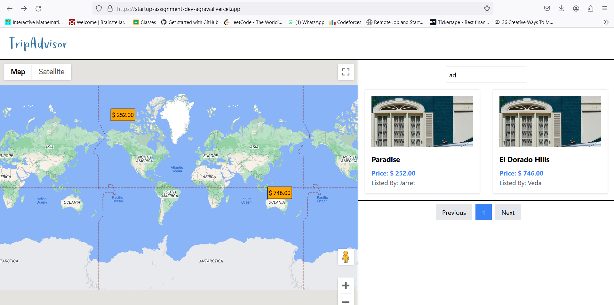

This is a Tour booking site consist of different location over the globe.

## Getting Started

To get started, follow these steps:

```bash
# Clone the repository
git clone https://github.com/your-username/Startup-assignment-Dev-Agrawal.git

# Change into the frontend directory
cd Startup-assignment-Dev-Agrawal
cd frontend

# Install dependencies
npm install

# Start the development server
npm start

```

# Video of the assignment

Video Url:- https://www.loom.com/share/643cd20d8362488699d214bf03c2ad4c

In this video, I explain the assignment I completed for our team using the Google Map API. I demonstrate how I integrated the API to create search functionality, pagination, and popups/markers on the map. I also provide a walkthrough of the code I used for the assignment. Please watch the video to see the final result 

# Snapshots of the project





